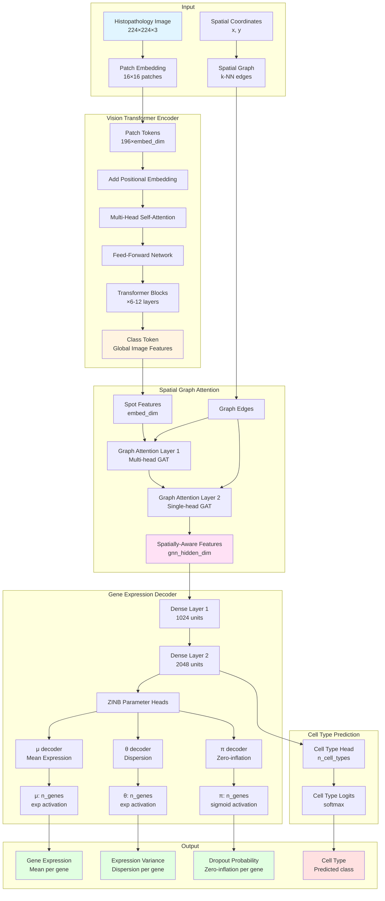
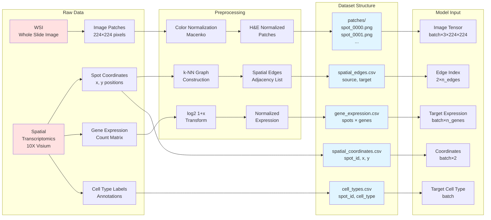
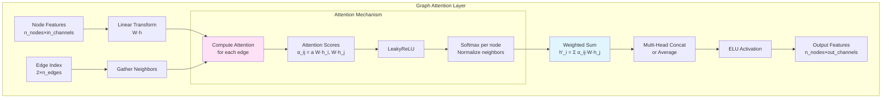
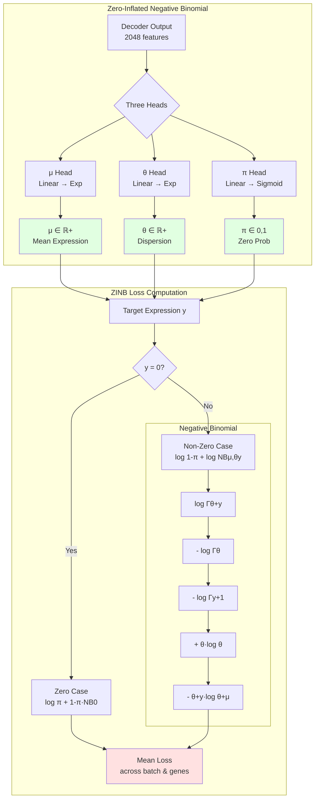
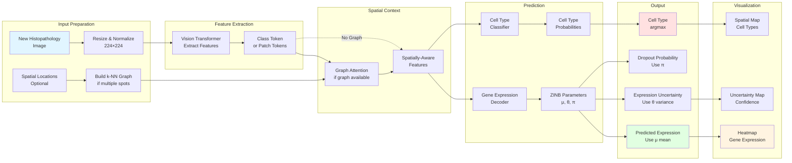
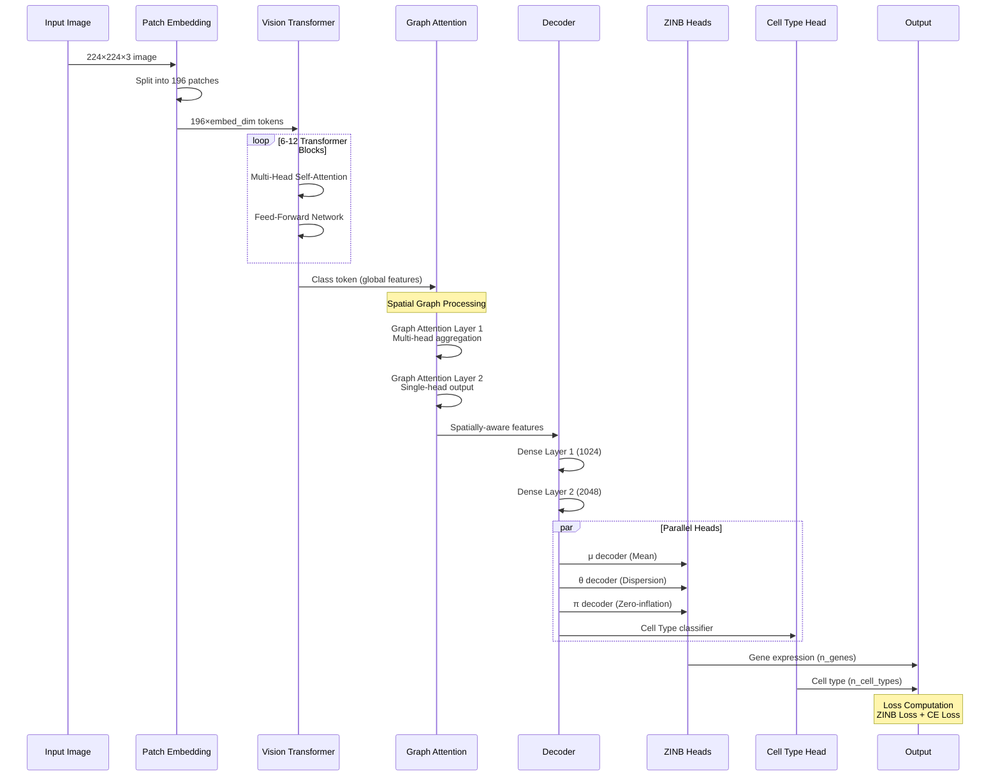
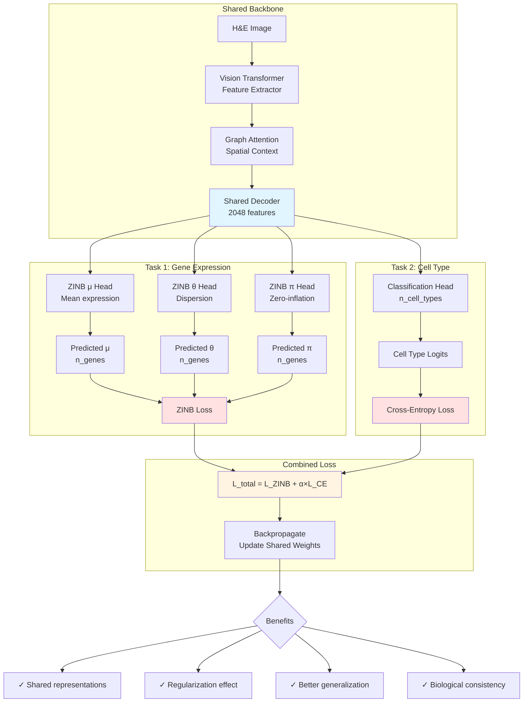
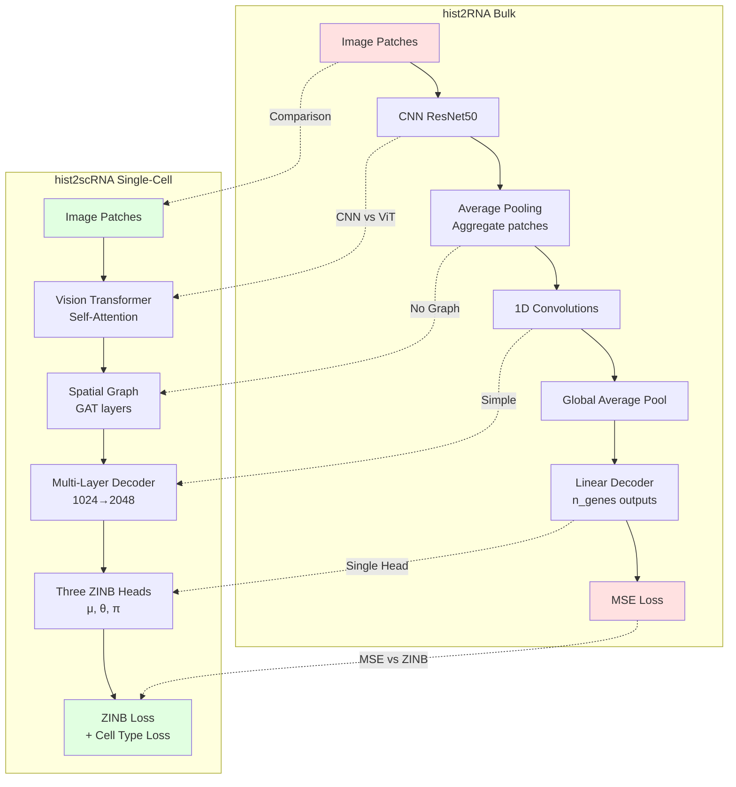
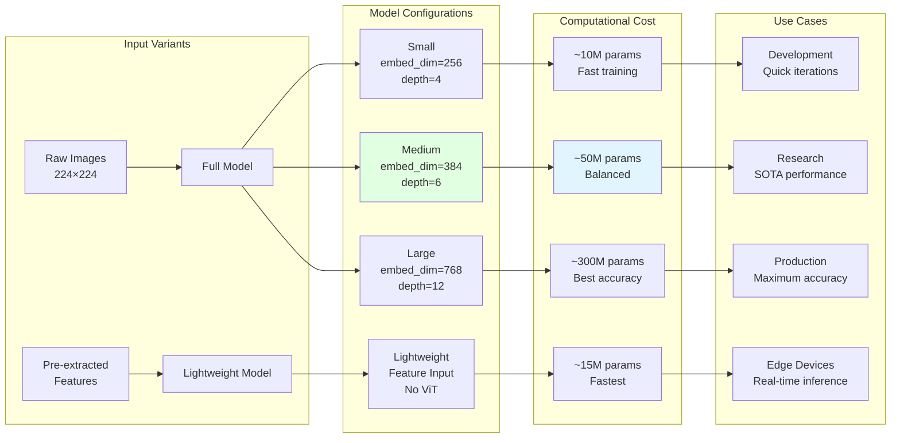

# hist2scRNA Architecture Diagrams

This document provides visual diagrams of the hist2scRNA model architecture, data flow, and training process.

## Table of Contents
- [Overall Architecture](#overall-architecture)
- [Data Structure and Flow](#data-structure-and-flow)
- [Training Pipeline](#training-pipeline)
- [Model Components](#model-components)
- [Inference Pipeline](#inference-pipeline)

---

## Overall Architecture



---

## Data Structure and Flow



---

## Training Pipeline

```mermaid
flowchart TD
    Start([Start Training]) --> Init[Initialize Model<br/>ViT + GAT + Decoder]
    Init --> LoadData[Load Dataset<br/>Images + Expression + Graph]

    LoadData --> Split{Split Data}
    Split --> Train[Training Set<br/>70%]
    Split --> Val[Validation Set<br/>15%]
    Split --> Test[Test Set<br/>15%]

    Train --> Epoch{For Each Epoch}

    Epoch --> TrainLoop[Training Loop]

    subgraph "Training Loop"
        TrainLoop --> Batch1[Get Batch<br/>images, targets, edges]
        Batch1 --> Forward1[Forward Pass<br/>ViT → GAT → Decoder]
        Forward1 --> Loss1[Compute Losses]

        subgraph "Loss Computation"
            Loss1 --> ZINB[ZINB Loss<br/>Gene Expression]
            Loss1 --> CE[Cross-Entropy<br/>Cell Type]
            ZINB --> Combined[Combined Loss<br/>L = L_ZINB + α×L_CE]
            CE --> Combined
        end

        Combined --> Backward[Backward Pass<br/>Compute Gradients]
        Backward --> Update[Update Parameters<br/>AdamW Optimizer]
    end

    Update --> ValLoop[Validation Loop]

    subgraph "Validation Loop"
        ValLoop --> Batch2[Get Batch<br/>No Gradient]
        Batch2 --> Forward2[Forward Pass]
        Forward2 --> Metrics[Compute Metrics]

        subgraph "Metrics"
            Metrics --> M1[Val Loss]
            Metrics --> M2[Spearman Corr]
            Metrics --> M3[Cell Type Acc]
        end
    end

    M1 --> CheckImprove{Val Loss<br/>Improved?}
    CheckImprove -->|Yes| Save[Save Best Model<br/>Checkpoint]
    CheckImprove -->|No| Counter[Increment Counter]

    Save --> LR[Update LR<br/>ReduceLROnPlateau]
    Counter --> LR

    LR --> EarlyStop{Early<br/>Stopping?}
    EarlyStop -->|No| Epoch
    EarlyStop -->|Yes| LoadBest[Load Best Model]

    Epoch -->|All Epochs Done| LoadBest

    LoadBest --> TestLoop[Test Evaluation]

    subgraph "Test Evaluation"
        TestLoop --> TestMetrics[Compute Test Metrics]
        TestMetrics --> TM1[MSE, MAE]
        TestMetrics --> TM2[Per-Spot Correlation]
        TestMetrics --> TM3[Per-Gene Correlation]
        TestMetrics --> TM4[Cell Type Accuracy]
    end

    TM4 --> SaveResults[Save Results<br/>results.json]
    SaveResults --> PlotCurves[Plot Training Curves<br/>Loss vs Epoch]
    PlotCurves --> End([Training Complete])

    style Start fill:#e1ffe1
    style ZINB fill:#ffe1e1
    style CE fill:#ffe1e1
    style Save fill:#e1f5ff
    style End fill:#e1ffe1
```

---

## Model Components Deep Dive

### Vision Transformer Block

```mermaid
graph TB
    subgraph "Single Transformer Block"
        A[Input Features<br/>batch×n_tokens×embed_dim] --> B[Layer Norm 1]
        B --> C[Multi-Head Self-Attention]

        subgraph "Multi-Head Self-Attention"
            C --> D[Linear: Q, K, V<br/>embed_dim → 3×embed_dim]
            D --> E[Split into<br/>num_heads heads]
            E --> F[Scaled Dot-Product<br/>Attention per head]
            F --> G[Concat heads]
            G --> H[Linear Projection<br/>embed_dim → embed_dim]
        end

        H --> I[Dropout]
        I --> J[Residual Add]
        A --> J

        J --> K[Layer Norm 2]
        K --> L[Feed-Forward Network]

        subgraph "Feed-Forward Network"
            L --> M[Linear 1<br/>embed_dim → 4×embed_dim]
            M --> N[GELU Activation]
            N --> O[Dropout]
            O --> P[Linear 2<br/>4×embed_dim → embed_dim]
            P --> Q[Dropout]
        end

        Q --> R[Residual Add]
        J --> R
        R --> S[Output Features<br/>batch×n_tokens×embed_dim]
    end

    style C fill:#e1f5ff
    style L fill:#ffe1f5
```



### Graph Attention Network



### ZINB Distribution and Loss



---

## Inference Pipeline



---

## Data Flow Through Full Model



---

## Multi-Task Learning Architecture



---

## Comparison: Bulk vs Single-Cell Models



---

## Model Scalability and Variants



---

## Key Design Decisions

| Component | Choice | Rationale |
|-----------|--------|-----------|
| **Encoder** | Vision Transformer | Captures long-range tissue architecture better than CNNs |
| **Spatial Model** | Graph Attention Network | Learns importance of different neighbors, handles irregular grids |
| **Loss Function** | Zero-Inflated Negative Binomial | Properly models sparsity (70-90% zeros) and overdispersion in scRNA-seq |
| **Multi-task** | Gene Expression + Cell Type | Shared representations improve both tasks, biological consistency |
| **Activation** | GELU in ViT, ELU in GAT | Smooth gradients, better than ReLU for transformers |
| **Normalization** | LayerNorm | Works better with attention mechanisms than BatchNorm |
| **Pooling** | Class Token | Learnable global representation, better than average pooling |

---

*These diagrams provide a comprehensive visual guide to understanding the hist2scRNA architecture and workflow.*
